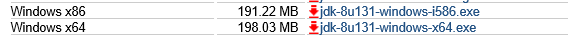

#SpringMVC概念

##Overview

* Springmvc的基础知识

* springmvc框架原理（掌握）
  前端控制器、处理器映射器、处理器适配器、视图解析器

* mybatis逆向工程构建项目实例

* springmvc入门程序
	目的：对前端控制器、处理器映射器、处理器适配器、视图解析器学习
	
	非注解的处理器映射器、处理器适配器
	注解的处理器映射器、处理器适配器（掌握）

* springmvc和mybatis整合（掌握）
        springmvc注解开发:（掌握）

	常用的注解学习

	参数绑定（简单类型、pojo、集合类型）

	自定义参数绑定（掌握）

* springmvc的高级应用
       参数绑定（集合类型）

	数据回显
	
	上传图片
	
	json数据交互
	
	RESTful支持
	
	拦截器

##MVC模式

MVC = Model-View-Controller

#### Controller  
* process and validate user inputs data
* Interacts with the service layer for business logic
* Handles navigation logic

#### Model  
* The contract between the Controller and the View  
* Contains the data needed to render the View  
* Populated by the Controller

####View  
* renders the model data into UI elements

#### Benefits of MVC
* Decoupling views and models
* Reduces the complexity of design
* Makes code more flexible and maintainable

## 什么是springmvc

1. springmvc属于SpringFrameWork的后续产品，已经融合在Spring Web Flow里面.

2. springmvc是spring框架的一个模块，springmvc和spring无需通过中间整合层进行整合。

3. springmvc是一个基于mvc的web框架。

##技术栈

##mvc在b/s系统 下的应用

mvc是一个设计模式，mvc在b/s系统 下的应用:

##springmvc框架

###springmvc执行流程

1. 发起请求到前端控制器(DispatcherServlet)
2. 前端控制器请求HandlerMapping查找 Handler
    可以根据xml配置、注解进行查找
3. 处理器映射器HandlerMapping向前端控制器返回Handler
4. 前端控制器调用处理器适配器去执行Handler
5. 处理器适配器去执行Handler
6. Handler执行完成给适配器返回ModelAndView
7. 处理器适配器向前端控制器返回ModelAndView
    ModelAndView是springmvc框架的一个底层对象，包括 Model和view
8. 前端控制器请求视图解析器去进行视图解析
    根据逻辑视图名解析成真正的视图(jsp)
9. 视图解析器向前端控制器返回View
10. 前端控制器进行视图渲染
      视图渲染将模型数据(在ModelAndView对象中)填充到request域
11. 前端控制器向用户响应结果 

**组件:**

1. 前端控制器DispatcherServlet（不需要程序员开发）
作用接收请求，响应结果，相当于转发器，中央处理器。
有了DispatcherServlet减少了其它组件之间的耦合度。

2. 处理器映射器HandlerMapping(不需要程序员开发)
作用：根据请求的url查找Handler

3. 处理器适配器HandlerAdapter
作用：按照特定规则（HandlerAdapter要求的规则）去执行Handler

4. **处理器Handler(需要程序员开发)**
注意：编写Handler时按照HandlerAdapter的要求去做，这样适配器才可以去正确执行Handler

5. 视图解析器View resolver(不需要程序员开发)
作用：进行视图解析，根据逻辑视图名解析成真正的视图（view）

6. **视图View(需要程序员开发jsp)**
View是一个接口，实现类支持不同的View类型（jsp、freemarker、pdf...）

#入门程序
1. 以案例作为驱动。
2. springmvc和mybaits使用一个案例（商品订单管理）。
3. 功能需求：商品列表查询

##环境搭建
1. 数据库环境:oracle10g xe

* 商品列表

* 订单明细表

* 订单表

* 用户表

2. java环境

* JDK版本:	

* IDE:	
IntelliJ IDEA 2017.1

3. springmvc版本: 
springmvc 4.3.7

4. show dependencies

>pom.xml文件配置以及mybatis的逆向工程配置步骤见附录.

##配置前端控制器

在web.xml中配置前端控制器

##配置处理器适配器
在classpath下的springmvc.xml中配置处理器适配器

通过查看源码:

**此适配器能执行实现 Controller接口的Handler**

##开发Handler
需要实现 controller接口，才能由org.springframework.web.servlet.mvc.SimpleControllerHandlerAdapter适配器执行。

~~~
public class ItemsController implements Controller {
	@Override
	public ModelAndView handleRequest(HttpServletRequest request, HttpServletResponse response) throws Exception {
		// 调用service查找数据库,查询商品列表,这里使用静态数据模拟...
		// 调用service查找 数据库，查询商品列表，这里使用静态数据模拟
		List<Items> itemsList = new ArrayList<Items>();
		// 向list中填充静态数据
		//list.add(...);
		// 返回ModelAndView
		ModelAndView modelAndView = new ModelAndView();
		// 相当 于request的setAttribut，在jsp页面中通过itemsList取数据
		modelAndView.addObject("itemsList", itemsList);
		//指定视图...
		modelAndView.setViewName("/index.jsp");
		return modelAndView;
	}
}
~~~

##视图编写

在WEB-INF根目录中创建index.jsp文件.

为了使页面效果更加丰富,我们推荐使用bootstrap框架

##配置Handler

~~~
<!-- 配置Handler,采用的是第一种处理器适配器,实现Controller接口的方式 -->
<bean name="/queryItems.action" id="itemController1" class="com.mybatis.controller.ItemsController"></bean>
~~~

##配置处理器映射器

~~~
<!-- 处理器映射器将bean的name作为url进行查找.需要在配置handler的指定beanName(就是url)-->
<bean class="org.springframework.web.servlet.handler.BeanNameUrlHandlerMapping"></bean>
~~~

##配置视图解析器

~~~
<!-- 视图解析器,解析jsp的视图解析器,默认使用jstl标签,classpath下得有jstl包-->
<bean class="org.springframework.web.servlet.view.InternalResourceViewResolver"></bean>
~~~

##部署调试

#非注解的处理器映射器和适配器

##非注解的处理器映射器

>第一种处理器映射器

>>org.springframework.web.servlet.handler.BeanNameUrlHandlerMapping

>另一种映射器

>>org.springframework.web.servlet.handler.SimpleUrlHandlerMapping
>>>
~~~
<!-- 
	所有的映射器都实现了HandlerMapping接口
	处理映射器的另一种方式:可以出现多个映射器
	前端控制器判断url能让那个映射器处理就让哪个映射器进行处理.
	简单url映射
 -->
 <bean class="org.springframework.web.servlet.handler.SimpleUrlHandlerMapping">
	<property name="mappings">
		<props>
			<!-- 对itemsController进行url映射,url是/queryItem2.action -->
			<prop key="/queryItems2.action">itemController1</prop>
			<!-- 可以出现多个url指向同一个handler -->
			<prop key="/queryItems3.action">itemController1</prop>
		</props>
	</property>
 </bean>
~~~
>>>多个映射器可以并存，前端控制器判断url能让哪些映射器映射，就让正确的映射器处理。

##非注解的处理器适配器

>第一种处理器适配器-要求编写的Handler实现 Controller接口

>>org.springframework.web.servlet.mvc.SimpleControllerHandlerAdapter

>第二种处理器适配器-要求编写的Handler实现 HttpRequestHandler接口

>>org.springframework.web.servlet.mvc.HttpRequestHandlerAdapter

~~~
public class ItemsController2 implements HttpRequestHandler {
	@Override
	public void handleRequest(HttpServletRequest req, HttpServletResponse resp) throws ServletException, IOException {
		// TODO Auto-generated method stub
		// 调用service查找数据库,查询商品列表,这里使用静态数据模拟...

		// 调用service查找 数据库，查询商品列表，这里使用静态数据模拟
		List<Items> itemsList = new ArrayList<>();
		// 向list中填充静态数据
		//list.add(..);
		req.setAttribute("itemsList", itemsList);
		req.getRequestDispatcher("/index.jsp").forward(req, resp);
		//使用此方法可以通过修改response,设置响应的数据格式,比如响应json数据.
	}
}
~~~

>>>
~~~
使用此方法可以通过修改response，设置响应的数据格式，比如响应json数据
response.setCharacterEncoding("utf-8");
response.setContentType("application/json;charset=utf-8");
response.getWriter().write("json串");
~~~

##DispatcherSerlvet.properties

前端控制器从上边的文件中加载处理映射器、适配器、视图解析器等组件，

如果不在springmvc.xml中配置，使用默认加载的。

#注解的处理器映射器和适配器

在spring3.1之前使用org.springframework.web.servlet.mvc.annotation.DefaultAnnotationHandlerMapping注解映射器。

在spring3.1之后使用org.springframework.web.servlet.mvc.method.annotation.RequestMappingHandlerMapping注解映射器。

在spring3.1之前使用org.springframework.web.servlet.mvc.annotation.AnnotationMethodHandlerAdapter注解适配器。

在spring3.1之后使用org.springframework.web.servlet.mvc.method.annotation.RequestMappingHandlerAdapter注解适配器。

##配置注解映射器和适配器

~~~
<!--注解的映射器,spring3.1以后使用-->
<bean class="org.springframework.web.servlet.mvc.method.annotation.RequestMappingHandlerMapping"></bean>
<!--注解的适配器,spring3.1以后使用-->
<bean class="org.springframework.web.servlet.mvc.method.annotation.RequestMappingHandlerAdapter"></bean>
<!--使用mvc的注解驱动可以代替以上俩个注解映射器和注解适配器的配置
   默认加载了很多的参数绑定方法,比如json转换解析器默认就加载了..
   实际开发时使用-->
<!--<mvc:annotation-driven></mvc:annotation-driven>-->
~~~

##开发注解Handler
使用注解的映射器和注解的适配器。（注解的映射器和注解的适配器必须配对使用）

~~~
//使用该注解标识它是一个控制器
@Controller
public class ItemsController3 {
    //商品查询
    //该注解实现对queryItem方法和url进行映射,一个方法对应一个url
    //一般建议将url和方法写成一样
    @RequestMapping("/queryItemsList")
    public ModelAndView queryItems() throws Exception{
         List<Items> itemsList = new ArrayList<>();
        // 向list中填充静态数据
        //list.add(..);
        // 返回ModelAndView
        ModelAndView modelAndView = new ModelAndView();
        // 相当 于request的setAttribut，在jsp页面中通过itemsList取数据
        modelAndView.addObject("itemsList", itemsList);
        //指定视图...如果视图解析器配置了前缀和后缀的话

        //此种方式,需要在springmvc.xml配置视图解析器指定前缀和后缀.
        modelAndView.setViewName("items/index");
        return modelAndView;
    }
    //可以定义其他的方法...
    //商品添加...
}
~~~

##在spring容器中加载Handler

~~~
<!-- 对于注解的Handler可以单个配置实际开发中建议使用组件扫描-->
<!-- <bean class="com.mybatis.controller.ItemsController3" /> -->
<!-- 可以扫描controller、service、...这里让扫描controller，指定controller的包-->
<context:component-scan base-package="com.mybatis.controller"></context:component-scan>
~~~

##在spring容器中配置视图解析器前缀和后缀
~~~
<!-- 视图解析器 ,解析jsp的视图解析器,默认使用jstl标签,classpath下得有jstl包-->
<!--<bean class="org.springframework.web.servlet.view.InternalResourceViewResolver"></bean>-->

<!--可以为视图解析器配置前缀和后缀-->
<bean class="org.springframework.web.servlet.view.InternalResourceViewResolver">
	<property name="prefix" value="/WEB-INF/jsp/"/>
	<property name="suffix" value=".jsp"/>
</bean>
~~~

##部署测试
访问：http://localhost:8888/queryItemsList.action

#源码分析(了解)

通过前端控制器源码分析springmvc的执行过程

第一步：前端控制器接收请求

调用doDiapatch

~~~
protected void doDispatch(HttpServletRequest request, HttpServletResponse response) throws Exception {
	HttpServletRequest processedRequest = request;
	HandlerExecutionChain mappedHandler = null;
	boolean multipartRequestParsed = false;
	//..
}
~~~

第二步:前端控制器调用处理器映射器查找 Handler

~~~
//返回一个执行链
mappedHandler = getHandler(processedRequest);

/**
 * Return the HandlerExecutionChain for this request.
 * 
Tries all handler mappings in order.
 * @param request current HTTP request
 * @return the HandlerExecutionChain, or {@code null} if no handler could be found
 */
protected HandlerExecutionChain getHandler(HttpServletRequest request) throws Exception {
	for (HandlerMapping hm : this.handlerMappings) {
		if (logger.isTraceEnabled()) {
			logger.trace(
					"Testing handler map [" + hm + "] in DispatcherServlet with name '" + getServletName() + "'");
		}
		HandlerExecutionChain handler = hm.getHandler(request);
		if (handler != null) {
			return handler;
		}
	}
	return null;
}
~~~

第三步:调用处理器适配器执行Handler，得到执行结果ModelAndView

~~~
// Determine handler adapter for the current request.
HandlerAdapter ha = getHandlerAdapter(mappedHandler.getHandler());
// Actually invoke the handler.
mv = ha.handle(processedRequest, response, mappedHandler.getHandler());
~~~

第四步:视图渲染，将model数据填充到request域
视图解析，得到view:

~~~
view = resolveViewName(mv.getViewName(), mv.getModelInternal(), locale, request);
~~~