#springmvc和mybatis整合
##需求
使用springmvc和mybatis完成商品列表查询。

##整合思路
**springmvc+mybaits的系统架构：**

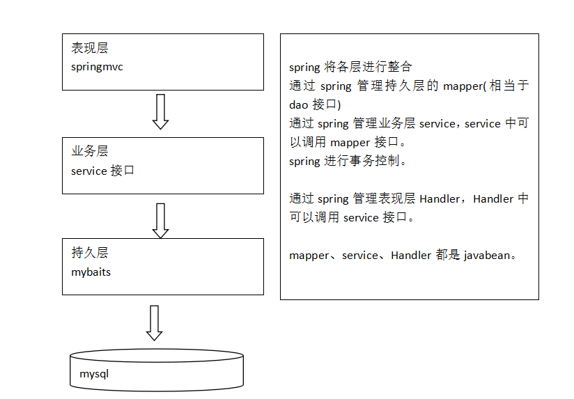

1. 整合dao层
	mybatis和spring整合，通过spring管理mapper接口。
	使用mapper的扫描器自动扫描mapper接口在spring中进行注册。

2. 整合service层
	通过spring管理 service接口。
	使用配置方式将service接口配置在spring配置文件中。
	实现事务控制。

3. 整合springmvc
	由于springmvc是spring的模块，不需要整合。

##工程结构
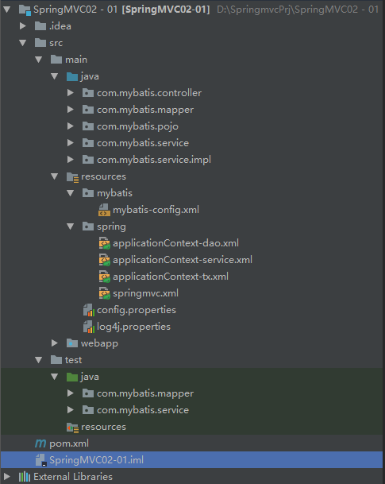

##整合dao
mybatis和spring进行整合

###mybatis-config.xml
src/main/resources/mybatis/mybatis-config.xml

这是mybatis自己的配置文件

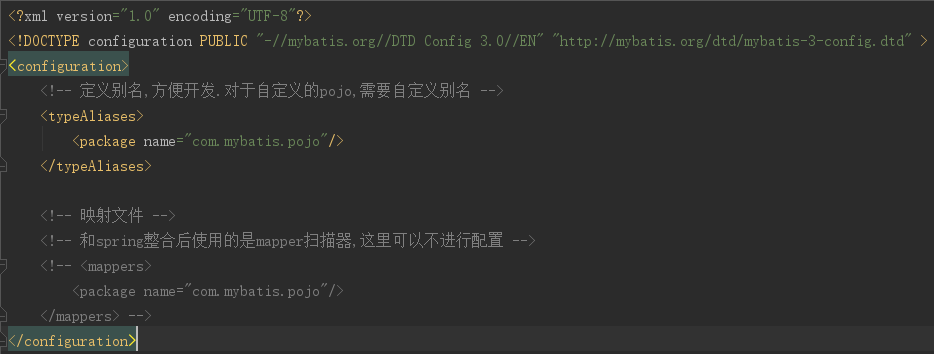

###applicationContext-dao.xml
配置:1.数据源,2.SqlSessionFactory,3.mapper扫描器

~~~
<?xml version="1.0" encoding="UTF-8"?>
<beans xmlns="http://www.springframework.org/schema/beans"
	   xmlns:xsi="http://www.w3.org/2001/XMLSchema-instance"
	   xmlns:context="http://www.springframework.org/schema/context"
	   xsi:schemaLocation="http://www.springframework.org/schema/beans http://www.springframework.org/schema/beans/spring-beans.xsd
		http://www.springframework.org/schema/context http://www.springframework.org/schema/context/spring-context-4.3.xsd">
	<!-- 加载配置文件 -->
	<context:property-placeholder location="classpath:config.properties"/>
	<!-- 数据源,使用dbcp -->
	<bean id="dataSource" class="org.apache.commons.dbcp.BasicDataSource">
		<property name="driverClassName" value="${drivers}"></property>
		<property name="url" value="${urls}"></property>
		<property name="username" value="${user}"></property>
		<property name="password" value="${passwords}"></property>
		<property name="initialSize" value="${initialSizes}"></property>
		<property name="maxActive" value="${maxActives}"></property>
	</bean>
	<!-- 配置sqlSessionFactory -->
	<bean id="sqlSessionFactory" class="org.mybatis.spring.SqlSessionFactoryBean">
		<!-- 加载mybatis的配置文件 -->
		<property name="configLocation" value="classpath:mybatis/mybatis-config.xml"></property>
		<!-- 数据源 -->
		<property name="dataSource" ref="dataSource"></property>
	</bean>
	<!-- Mapper的批量扫描,从mpper包中扫描mapper接口,自动创建代理对象并且在spring容器中注入
	     自动扫描出来的mapper的bean的id为mapper类名[首字母小写]
	 -->
	<bean class="org.mybatis.spring.mapper.MapperScannerConfigurer">
		<!-- 指定扫描的包名如果扫描多个包,使用半角逗号隔开.-->
		<property name="basePackage" value="com.mybatis.mapper"></property>
		<!--配置mapper的数据源-->
		<property name="sqlSessionFactoryBeanName" value="sqlSessionFactory"></property>
	</bean>
</beans>
~~~

###逆向工程生成po类及mapper(单表增删改查)
参见附录2

将生成的文件拷贝至工程 中。

###手动定义商品查询mapper

**针对综合查询mapper，一般情况会有关联查询，建议自定义mapper**

~~~
/**
 * 商品信息的扩展类
 * Created by Administrator on 2017/4/9 0009.
 */
public class ItemsCustom extends MybatisItems{
    //添加商品信息的扩展属性.
}

/**
 * 商品查询包装对象
 * Created by Administrator on 2017/4/9 0009.
 */
public class ItemsQueryVo {
    //商品信息
    private MybatisItems items;

    //为了系统可扩展性,对原始生成的po进行拓展
    private ItemsCustom itemsCustom;
    
    //getter/setter
}
~~~

####ItemsMapperCustom.xml

####ItemsMapperCustom.java
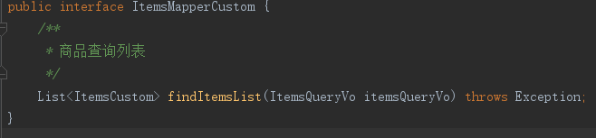

##整合service
让spring管理service接口。

###定义service接口
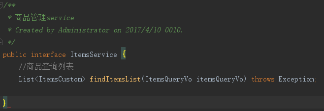

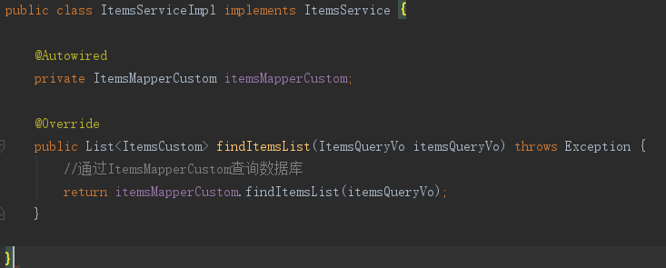

###spring容器配置service(applicationContext-service.xml)
创建applicationContext-service.xml，文件中配置service

~~~
<?xml version="1.0" encoding="UTF-8"?>
<beans xmlns="http://www.springframework.org/schema/beans"
	   xmlns:xsi="http://www.w3.org/2001/XMLSchema-instance"
	   xsi:schemaLocation="http://www.springframework.org/schema/beans http://www.springframework.org/schema/beans/spring-beans.xsd">
	<!--商品管理的service-->
	<bean id="itemsService" class="com.mybatis.service.impl.ItemsServiceImpl"></bean>
</beans>
~~~

**注意:也是可以采用注解配置的,@Service**

###事务控制(applicationContext-transaction.xml)
在applicationContext-transaction.xml中使用spring声明式事务控制方法。

~~~
<beans xmlns="http://www.springframework.org/schema/beans"
	   xmlns:xsi="http://www.w3.org/2001/XMLSchema-instance"
	   xmlns:aop="http://www.springframework.org/schema/aop" xmlns:tx="http://www.springframework.org/schema/tx"
	   xsi:schemaLocation="http://www.springframework.org/schema/beans
		http://www.springframework.org/schema/beans/spring-beans-3.2.xsd
		http://www.springframework.org/schema/aop
		http://www.springframework.org/schema/aop/spring-aop-3.2.xsd
		http://www.springframework.org/schema/tx
		http://www.springframework.org/schema/tx/spring-tx-3.2.xsd ">
        <!--idea中导入资源配置文件-->
	<import resource="applicationContext-dao.xml"/>
	<!-- 事务管理器
	对mybatis操作数据库事务控制，spring使用jdbc的事务控制类
	-->
	<bean id="transactionManager" class="org.springframework.jdbc.datasource.DataSourceTransactionManager">
		<property name="dataSource" ref="dataSource"></property>
	</bean>
	<!-- 通知 -->
	<tx:advice id="txAdvice" transaction-manager="transactionManager">
		<tx:attributes>
			<!-- 传播行为 -->
			<tx:method name="save*" propagation="REQUIRED"/>
			<tx:method name="delete*" propagation="REQUIRED"/>
			<tx:method name="insert*" propagation="REQUIRED"/>
			<tx:method name="update*" propagation="REQUIRED"/>
			<tx:method name="find*" propagation="SUPPORTS" read-only="true"/>
			<tx:method name="get*" propagation="SUPPORTS" read-only="true"/>
			<tx:method name="select*" propagation="SUPPORTS" read-only="true"/>
		</tx:attributes>
	</tx:advice>
	<!-- aop -->
	<aop:config>
		<aop:advisor advice-ref="txAdvice" pointcut="execution(* com.mybatis.service.impl.*.*(..))"/>
	</aop:config>
</beans>
~~~

##整合springmvc
###springmvc.xml
创建springmvc.xml文件，配置处理器映射器、适配器、视图解析器。

~~~
<beans xmlns="http://www.springframework.org/schema/beans"
	   xmlns:xsi="http://www.w3.org/2001/XMLSchema-instance" xmlns:mvc="http://www.springframework.org/schema/mvc"
	   xmlns:context="http://www.springframework.org/schema/context"
	   xsi:schemaLocation="http://www.springframework.org/schema/beans
		http://www.springframework.org/schema/beans/spring-beans-3.2.xsd
		http://www.springframework.org/schema/mvc
		http://www.springframework.org/schema/mvc/spring-mvc-3.2.xsd
		http://www.springframework.org/schema/context
		http://www.springframework.org/schema/context/spring-context-3.2.xsd">
	<!-- 视图解析器,解析jsp的视图解析器,默认使用jstl标签,classpath下得有jstl包-->
	<bean class="org.springframework.web.servlet.view.InternalResourceViewResolver">
			<!--可以为视图解析器配置前缀和后缀-->
			<property name="prefix" value="/WEB-INF/jsp/"/>
			<property name="suffix" value=".jsp"/>
	</bean>

	<!--对应注解的handler可以单独配置,实际开发中建议使用组件扫描-->
	<context:component-scan base-package="com.mybatis.controller"></context:component-scan>

	<!--使用mvc的注解驱动可以代替以下俩个注解映射器和注解适配器的配置
	   默认加载了很多的参数绑定方法,比如json转换解析器默认就加载了.. 实际开发时使用...
	-->
	<mvc:annotation-driven></mvc:annotation-driven>
	<!--<bean class="org.springframework.web.servlet.mvc.method.annotation.RequestMappingHandlerMapping"/>
	<bean class="org.springframework.web.servlet.mvc.method.annotation.RequestMappingHandlerAdapter"/>-->
</beans>
~~~

###配置前端控制器
参考入门程序

###编写Controller(就是Handler)

~~~
//使用该注解标识它是一个控制器
@Controller
public class ItemsController3 {
    @Autowired
    private ItemsService itemsService;
    //商品查询
    //该注解实现对queryItem方法和url进行映射,一个方法对应一个url
    //一般建议将url和方法写成一样
    @RequestMapping("/queryItemsList")
    public ModelAndView queryItems(HttpServletRequest req) throws Exception{

        // 调用service查找数据库,查询商品列表
        List<ItemsCustom> itemsList = itemsService.findItemsList(null);

        // 返回ModelAndView
        ModelAndView modelAndView = new ModelAndView();
        // 相当 于request的setAttribut，在jsp页面中通过itemsList取数据
        modelAndView.addObject("itemsList", itemsList);
        //指定视图...如果视图解析器配置了前缀和后缀的话

        modelAndView.setViewName("items/index");
        return modelAndView;
    }
}
~~~

##加载spring容器
将mapper、service、controller加载到spring容器中。

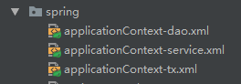

建议使用通配符加载上边的配置文件。

在web.xml中，添加spring容器监听器，加载spring容器。

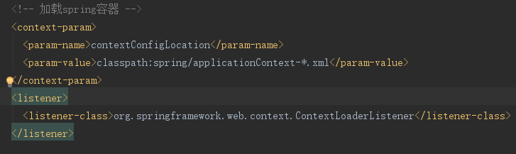

#商品修改功能开发
##需求
操作流程：

1. 进入商品查询列表页面

2. 点击修改，进入商品修改页面，页面中显示了要修改的商品（从数据库查询）
	要修改的商品从数据库查询，根据商品id(主键)查询商品信息

3. 在商品修改页面，修改商品信息，修改后，点击提交

##开发mapper
mapper：

	根据id查询商品信息

	根据id更新Items表的数据

不用开发了，使用逆向工程生成的代码。

##开发service
接口功能：

	根据id查询商品信息

	修改商品信息

~~~
/**
 * 商品管理service
 * Created by Administrator on 2017/4/10 0010.
 */
public interface ItemsService {
    //商品查询列表
    List<ItemsCustom> findItemsList(ItemsQueryVo itemsQueryVo) throws Exception;

    //根据id查询商品信息
    /**
     *
     * 
Title: findItemsById

     * 
Description: 

     * @param id 查询商品的id
     * @return
     * @throws Exception
     */
    ItemsCustom findItemsById(Long id) throws Exception;

    //修改商品信息
    /**
     *
     * 
Title: updateItems

     * 
Description: 

     * @param id 修改商品的id
     * @param itemsCustom 修改的商品信息
     * @throws Exception
     */
    void updateItems(Long id,ItemsCustom itemsCustom) throws Exception;
~~~

##开发controller
方法：
	
	商品信息修改页面显示

	商品信息修改提交

# 注解@RequestMapping

>* url映射
>>定义controller方法对应的url，进行处理器映射使用。

>* 窄化请求映射
>>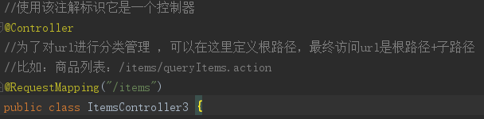

>* 限制http请求方法
>>出于安全性考虑，对http的链接进行方法限制。
>>如果限制请求为post方法，进行get请求，报错：
>>
>>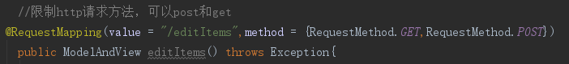

#controller方法的返回值
>1 返回ModelAndView
>>需要方法结束时，定义ModelAndView，将model和view分别进行设置。
>>>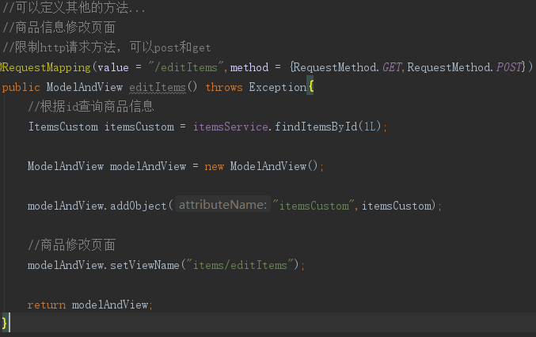

>2 返回string
>>如果controller方法返回string
>>>a.表示返回逻辑视图名。
>>>>真正视图(jsp路径)=前缀+逻辑视图名+后缀
>>>>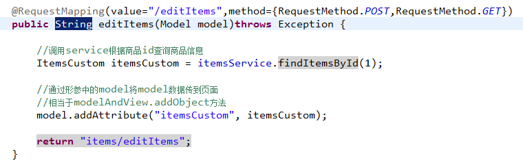

>>>b.redirect重定向
>>>>商品修改提交后，重定向到商品查询列表。

>>>>redirect重定向特点：浏览器地址栏中的url会变化。修改提交的request数据无法传到重定向的地址。

>>>>因为重定向后重新进行request（request无法共享）

>>>>
~~~
//重定向商品的查询页面
return "redirect:queryItemsList.action";
~~~

>>>c.forward页面转发
>>>>通过forward进行页面转发，浏览器地址栏url不变，request可以共享。
>>>>
~~~
//页面转发
return "forward:queryItemsList.action";
~~~

>3 返回void
>>在controller方法形参上可以定义request和response，使用request或response指定响应结果：
>>>1.使用request转向页面，如下：
>>>>request.getRequestDispatcher("页面路径").forward(request, response);

>>>2.也可以通过response页面重定向：
>>>>response.sendRedirect("url")

>>>3.也可以通过response指定响应结果，例如响应json数据如下：
>>>>response.setCharacterEncoding("utf-8");

>>>>response.setContentType("application/json;charset=utf-8");

>>>>response.getWriter().write("json串");

#参数绑定
##spring参数绑定过程
从客户端请求key/value数据，经过参数绑定，将key/value数据绑定到controller方法的形参上。

springmvc中，接收页面提交的数据是通过方法形参来接收。而不是在controller类定义成员变更接收！！！！

##默认支持的类型
直接在controller方法形参上定义下边类型的对象，就可以使用这些对象。在参数绑定过程中，如果遇到下边类型直接进行绑定。
###HttpServletRequest
通过request对象获取请求信息
###HttpServletResponse
通过response处理响应信息
###HttpSession
通过session对象得到session中存放的对象
###Model/ModelMap
model是一个接口，modelMap是一个接口实现 。

作用：将model数据填充到request域。

##简单类型
通过@RequestParam对简单类型的参数进行绑定。

如果不使用@RequestParam，要求request传入参数名称和controller方法的形参名称一致，方可绑定成功。

如果使用@RequestParam，不用限制request传入参数名称和controller方法的形参名称一致。

通过required属性指定参数是否必须要传入，如果设置为true，没有传入参数，报下边错误：

~~~
//通过@RequestParam对简单类型的参数进行绑定。
// 如果不使用@RequestParam，要求request传入参数名称和controller方法的形参名称一致，方可绑定成功。
// public String editItems(Model model, Long id) throws Exception{
// 如果使用@RequestParam，不用限制request传入参数名称和controller方法的形参名称一致。
//通过required属性指定参数是否必须要传入，如果设置为true，没有传入参数，报下边错误：
public String editItems(Model model,@RequestParam(value = "id",required = true,defaultValue = "1") Long items_id) throws Exception{}
~~~

参考教案 对其它简单类型绑定进行测试。

##pojo绑定
注意: **页面中input的name和controller的pojo形参中的属性名称一致，将页面中数据绑定到pojo**

~~~
页面定义:
<input type="text" name="name" class="form-control" id="inputUserName" value="${itemsCustom.name}"/>
<input type="text" name="price" class="form-control" id="inputItemPrice" value="${itemsCustom.price}"/>

controller的pojo形参的定义：
public class MybatisItems {
    private Long id;

    private String name;

    private Double price;
}
~~~

##自定义参数绑定实现日期类型绑定

对于controller形参中pojo对象，如果属性中有日期类型，需要自定义参数绑定。

将请求日期数据串传成 日期类型，要转换的日期类型和pojo中日期属性的类型保持一致。

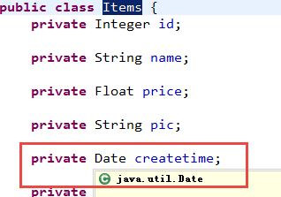

所以自定义参数绑定将日期串转成java.util.Date类型。

需要向处理器适配器中注入自定义的参数绑定组件。

###自定义日期类型绑定方式一

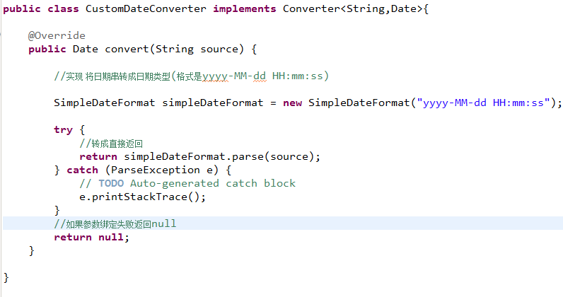

###配置方式

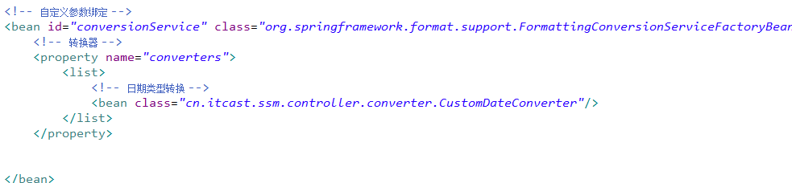

###自定义日期类型绑定方式二
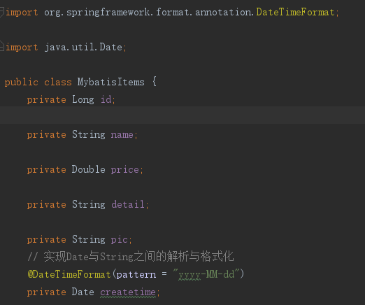

#问题
##post乱码
在web.xml添加post乱码filter

在web.xml中加入：

~~~
<filter>
	<filter-name>CharacterEncodingFilter</filter-name>
	<filter-class>org.springframework.web.filter.CharacterEncodingFilter</filter-class>
	<init-param>
		<param-name>encoding</param-name>
		<param-value>utf-8</param-value>
	</init-param>
</filter>
<filter-mapping>
	<filter-name>CharacterEncodingFilter</filter-name>
	<url-pattern>/*</url-pattern>
</filter-mapping>
~~~

以上可以解决post请求乱码问题。
对于get请求中文参数出现乱码解决方法有两个：

修改tomcat配置文件添加编码与工程编码一致，如下：

~~~
<Connector URIEncoding="utf-8" connectionTimeout="20000" port="8080" protocol="HTTP/1.1" redirectPort="8443"/>
~~~

另外一种方法对参数进行重新编码：

~~~
String userName = new String(request.getParamter("userName").getBytes("ISO8859-1"),"utf-8");

ISO8859-1是tomcat默认编码，需要将tomcat编码后的内容按utf-8编码
~~~

本项目中采用maven中的tomcat插件,配置如下:

~~~
<!-- tomcat服务器插件 -->
<plugin>
<groupId>org.apache.tomcat.maven</groupId>
<artifactId>tomcat7-maven-plugin</artifactId>
<version>2.2</version>
<configuration>
  <server>tomcat7</server>
  <port>8888</port>
  <uriEncoding>utf-8</uriEncoding>
  <url>http://localhost:8888/manager/text</url>
  <path>/mvc03</path>
</configuration>
</plugin>
~~~