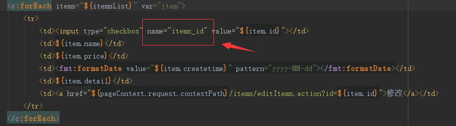
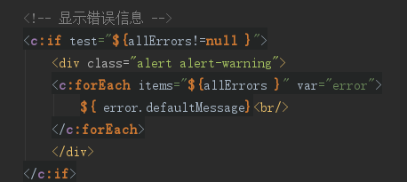

#高级知识
##课程安排
>1. 第一部分：
>>在商品查询和商品修改功能案例驱动下进行学习：
>>>a.包装类型pojo参数绑定（掌握）。 
>>>b.集合类型的参数绑定：数组、list、map.. 
>>>c.商品修改添加校验，学习springmvc提供校验validation（使用的是hibernate校验框架） 
>>>d.数据回显 
>>>e.统一异常处理（掌握）

>2. 第二部分：
>>a.上传图片 
>>b.json数据交互 
>>c.RESTful支持 
>>d.拦截器 

##项目整体截图
登录页面:

首页:

修改页面:

批量修改页面:

##包装类型pojo参数绑定
###需求
商品查询controller方法中实现商品查询条件传入。

###实现方法
>1. 第一种方法：在形参中 添加HttpServletRequest request参数，通过request接收查询条件参数。
>2. 第二种方法：在形参中让包装类型的pojo接收查询条件参数。
>>分析： 
>>a 页面传参数的特点：复杂，多样性。条件包括 ：用户账号、商品编号、订单信息。。。  
>>b 如果将用户账号、商品编号、订单信息等放在简单pojo（属性是简单类型）中，pojo类属性比较多，比较乱。  
>>c 建议使用包装类型的pojo，pojo中属性是pojo。

###页面参数和controller方法形参定义

1 页面参数：

~~~
商品名称：<input name="itemsCustom.name" />
~~~
**注意:itemsCustom和包装pojo中的属性一致即可**

2 controller方法形参：

~~~
public ModelAndView queryItems(HttpServletRequest request,ItemsQueryVo itemsQueryVo) throws Exception
~~~

##集合类型绑定

###数组绑定

####需求
商品批量删除，用户在页面选择多个商品，批量删除。

####表现层实现
1. 关键：将页面选择(多选)的商品id，

2. 传到controller方法的形参，方法形参使用数组接收页面请求的多个商品id。

3. controller方法定义：

4. 页面定义

###list绑定

####需求
通常在需要批量提交数据时，将提交的数据绑定到list<pojo>中，比如：成绩录入（录入多门课成绩，批量提交），

本例子需求：批量商品修改，在页面输入多个商品信息，将多个商品信息提交到controller方法中。

#####表现层实现
controller方法定义：

1. 进入批量商品修改页面(页面样式参考商品列表实现)
2. 批量修改商品提交
   使用List接收页面提交的批量数据，通过包装pojo接收，在包装pojo中定义list<pojo>属性

页面定义:

###Map绑定
自己去网上自学.

##springmvc校验
###校验理解

项目中，通常使用较多是前端的校验，比如页面中js校验。对于安全要求较高点建议在服务端进行校验。

服务端校验：

1. 控制层conroller：校验页面请求的参数的合法性。在服务端控制层conroller校验，不区分客户端类型（浏览器、手机客户端、远程调用）

2. 业务层service（使用较多）：主要校验关键业务参数，仅限于service接口中使用的参数。
	
3. 持久层dao：一般是不校验的。

###springmvc校验需求
springmvc使用hibernate的校验框架validation(和hibernate没有任何关系)。

1. 校验思路：
页面提交请求的参数，请求到controller方法中，使用validation进行校验。如果校验出错，将错误信息展示到页面。

2. 具体需求：
商品修改，添加校验（校验商品名称长度，商品简介的非空校验），如果校验出错，在商品修改页面显示错误信息。

3.pom.xml配置:

~~~
<dependency>
	<groupId>org.hibernate</groupId>
	<artifactId>hibernate-validator</artifactId>
	<version>5.3.0.Final</version>
</dependency>
~~~

###校验器注入到处理器适配器中

###Hibernate Validator的定义
它是 Bean Validation 的参考实现 . Hibernate Validator 提供了

JSR 303 规范中所有内置 constraint 的实现，除此之外还有一些附加的 constraint 

>
**Bean Validation 中内置的 constraint**
@Null   被注释的元素必须为 null  
@NotNull    被注释的元素必须不为 null  
@AssertTrue     被注释的元素必须为 true  
@AssertFalse    被注释的元素必须为 false  
@Min(value)     被注释的元素必须是一个数字，其值必须大于等于指定的最小值  
@Max(value)     被注释的元素必须是一个数字，其值必须小于等于指定的最大值  
@DecimalMin(value)  被注释的元素必须是一个数字，其值必须大于等于指定的最小值  
@DecimalMax(value)  被注释的元素必须是一个数字，其值必须小于等于指定的最大值  
@Size(max=, min=)   被注释的元素的大小必须在指定的范围内  
@Digits (integer, fraction)     被注释的元素必须是一个数字，其值必须在可接受的范围内  
@Past   被注释的元素必须是一个过去的日期  
@Future     被注释的元素必须是一个将来的日期  
@Pattern(regex=,flag=)  被注释的元素必须符合指定的正则表达式  

>
**Hibernate Validator 附加的 constraint** 
@NotBlank(message =)   验证字符串非null，且长度必须大于0  
@Email  被注释的元素必须是电子邮箱地址  
@Length(min=,max=)  被注释的字符串的大小必须在指定的范围内  
@NotEmpty   被注释的字符串的必须非空  
@Range(min=,max=,message=)  被注释的元素必须在合适的范围内  

###在pojo中添加校验规则
* 在MybatisItems.java中添加校验规则：
>

* 在CustomValidationMessages.properties配置校验错误信息：
>

###捕获校验错误信息

//在需要校验的pojo前边添加@Validated，在需要校验的pojo后边添加BindingResult bindingResult接收校验出错信息

//注意：@Validated和BindingResult bindingResult是配对出现，并且形参顺序是固定的（一前一后）。

###在页面显示校验错误信息
在controller中将错误信息传到页面即可。

页面显示错误信息：

###分组校验
####需求
在pojo中定义校验规则，而pojo是被多个 controller所共用，当不同的controller方法对同一个pojo进行校验，

但是每个controller方法需要不同的校验。

**解决方法：**

1. 定义多个校验分组（其实是一个java接口），分组中定义有哪些规则

2. 每个controller方法使用不同的校验分组

####校验分组

####在校验规则中添加分组

####在controller方法使用指定分组的校验

##数据回显
###什么数据回显
提交后，如果出现错误，将刚才提交的数据回显到刚才的提交页面。
###pojo数据回显方法
1. springmvc默认对pojo数据进行回显。
    pojo数据传入controller方法后，springmvc自动将pojo数据放到request域，key等于pojo类型（首字母小写）

    使用@ModelAttribute指定pojo回显到页面在request中的key

2. @ModelAttribute还可以将方法的返回值传到页面

    在商品查询列表页面，通过商品类型查询商品信息。
    在controller中定义商品类型查询方法，最终将商品类型传到页面。

    

    页面上可以得到itemTypes数据:

    

案例:

   

   

3. 使用最简单方法使用model，可以不用@ModelAttribute

  

###简单类型数据回显
  
使用最简单方法使用model。

model.addAttribute("id", id);