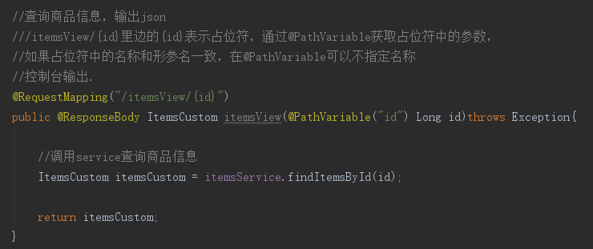
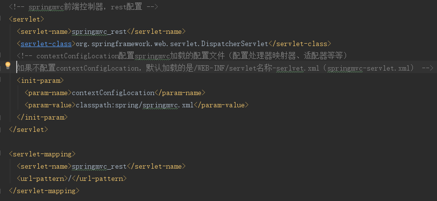
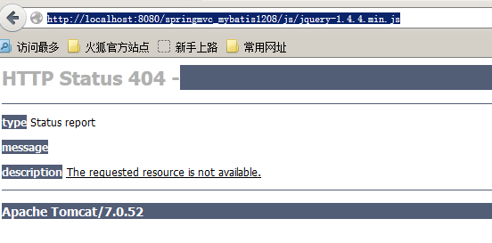
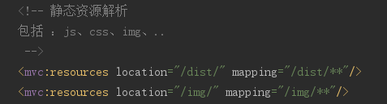

#RESTful支持
##什么是RESTful
>RESTful架构，就是目前最流行的一种互联网软件架构。它结构清晰、符合标准、易于理解、扩展方便，所以正得到越来越多网站的采用。

>RESTful（即Representational State Transfer的缩写）其实是一个开发理念，是对http的很好的诠释。

>1. 对url进行规范，写RESTful格式的url
>>a.非REST的url：http://...../queryItems.action?id=001&type=T01 
>>b.REST的url风格：http://..../items/001 
>>   **特点：url简洁，将参数通过url传到服务端**

>2. http的方法规范
>>不管是删除、添加、更新。。使用url是一致的，如果进行删除，需要设置http的方法为delete，同理添加. 
>>后台controller方法：判断http方法，如果是delete执行删除，如果是post执行添加。

>3. 对http的contentType规范
>>请求时指定contentType，要json数据，设置成json格式的type。

##REST的例子
###需求
查询商品信息，返回json数据.
###controller
定义方法，进行url映射使用REST风格的url，将查询商品信息的id传入controller .

输出json使用@ResponseBody将java对象输出json。

>@RequestMapping(value="/ itemsView/{id}")：{×××}占位符，请求的URL可以是“/viewItems/1”或“/viewItems/2”，

>通过在方法中使用@PathVariable获取{×××}中的×××变量。

>@PathVariable用于将请求URL中的模板变量映射到功能处理方法的参数上。

>如果RequestMapping中表示为"/ itemsView /{id}"，id和形参名称一致，@PathVariable不用指定名称。

###REST方法的前端控制器配置
在web.xml配置：

##对静态资源的解析
配置前端控制器的url-parttern中指定/，对静态资源的解析出现问题：

在springmvc.xml中添加静态资源解析方法。

