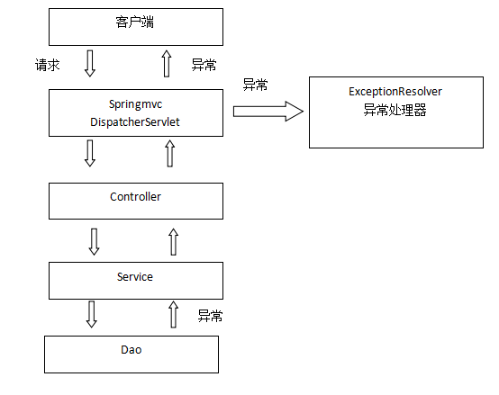
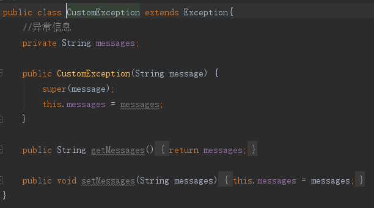
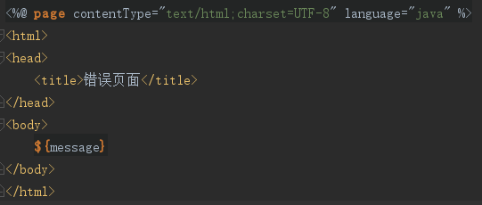
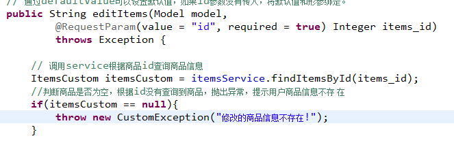
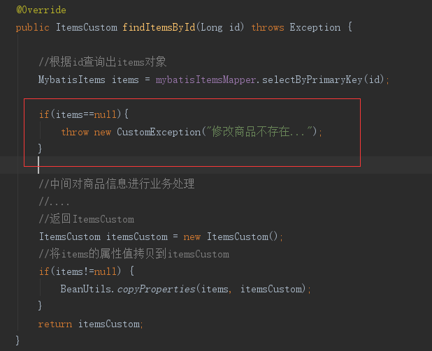

##异常处理
###异常处理思路
>系统中异常包括两类：预期异常和运行时异常RuntimeException，

>前者通过捕获异常从而获取异常信息，后者主要通过规范代码开发、测试通过手段减少运行时异常的发生。

>系统的dao、service、controller出现都通过throws Exception向上抛出，最后由springmvc前端控制器交由异常处理器进行异常处理，如下图：

 

 **springmvc提供全局异常处理器（一个系统只有一个异常处理器）进行统一异常处理。**

##自定义异常类
**对不同的异常类型定义异常类，继承Exception。**

 

 ##全局异常处理器
 思路：
>系统遇到异常，在程序中手动抛出，dao抛给service、service给controller、controller抛给前端控制器，前端控制器调用全局异常处理器。

>全局异常处理器处理思路：
>>1.解析出异常类型

>>2.如果该 异常类型是系统 自定义的异常，直接取出异常信息，在错误页面展示

>>3.如果该 异常类型不是系统 自定义的异常，构造一个自定义的异常类型（信息为“未知错误”）

**springmvc提供一个HandlerExceptionResolver接口**

~~~
/**
 * 全局异常处理器
 */
public class CustomExceptionResolver implements HandlerExceptionResolver{
    @Override
    public ModelAndView resolveException(HttpServletRequest request, HttpServletResponse response, Object handler, Exception ex) {
        //handler就是处理器适配器要执行Handler对象(只有method)

        //解析出异常类型
        //如果该异常类型是系统自定义的异常,直接取出异常信心,
        //在错误页面显示
       /* String message = null;

        if(ex instanceof CustomException){
            message = ((CustomException) ex).getMessages();
        }else{
            //如果该 异常类型不是系统 自定义的异常，构造一个自定义的异常类型（信息为“未知错误”）
            message = "未知错误";
        }*/

       //上边代码变为
        CustomException customException = null;

        if(ex instanceof CustomException){
            customException = (CustomException) ex;
        }else{
            System.out.println(ex.getMessage());
            customException = new CustomException("未知错误");
        }

        ModelAndView modelAndView = new ModelAndView();
        String message = customException.getMessage();
        //将错误信息传到页面k
        modelAndView.addObject("message",message);
        //指向错误页面
        modelAndView.setViewName("error");
        return modelAndView;
    }
}
~~~

##错误页面

##在springmvc.xml配置全局异常处理器

~~~
<!-- 全局异常处理器
      只要实现HandlerExceptionResolver接口就是全局异常处理器
 -->
<bean class="com.mybatis.exception.CustomExceptionResolver"></bean>
~~~

##异常测试
在controller、service、dao中任意一处需要手动抛出异常。

如果是程序中手动抛出的异常，在错误页面中显示自定义的异常信息，

如果不是手动抛出异常说明是一个运行时异常，在错误页面只显示“未知错误”。

在商品修改的controller方法中抛出异常 .

在service接口中抛出异常：

如果与业务功能相关的异常，建议在service中抛出异常。

与业务功能没有关系的异常，建议在controller中抛出。

上边的功能，建议在service中抛出异常。