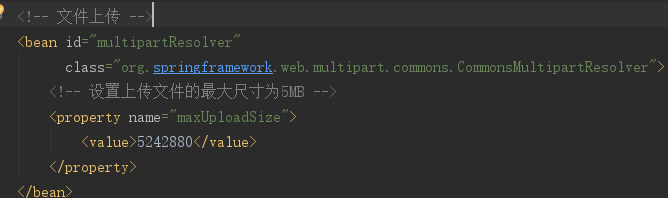
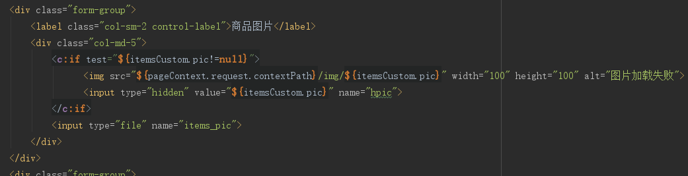
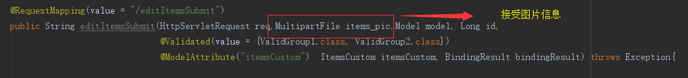

#上传图片
##需求
在修改商品页面，添加上传商品图片功能。
##springmvc中对多部件类型解析
>在 页面form中提交enctype="multipart/form-data"的数据时，需要springmvc对multipart类型的数据进行解析。

>在springmvc.xml中配置multipart类型解析器。

>>

##pom.xml中引入文件上传的依赖

~~~
<!--文件上传-->
<dependency>
	<groupId>commons-fileupload</groupId>
	<artifactId>commons-fileupload</artifactId>
	<version>1.3.2</version>
</dependency>
~~~

##上传图片代码
###页面

###controller方法

~~~
//Spring MVC 会按请求参数名和 POJO 属性名进行自动匹配，自动为该对象填充属性值。而且支持级联属性
//商品信息修改提交
//在需要校验的pojo前边添加@Validated，在需要校验的pojo后边添加BindingResult
//bindingResult接收校验出错信息
//注意：@Validated和BindingResult bindingResult是配对出现，并且形参顺序是固定的（一前一后）。
//@ModelAttribute可以指定pojo[基本类型不行]回显到页面在request中的key->推荐使用model
//@MultipartFile接收图片名字
@RequestMapping(value = "/editItemsSubmit")
public String editItemsSubmit(HttpServletRequest req,MultipartFile items_pic,Model model, Long id,
			  @Validated(value = {ValidGroup1.class, ValidGroup2.class})
			  @ModelAttribute("itemsCustom")  ItemsCustom itemsCustom, BindingResult bindingResult) throws Exception{

//获取校验错误信息
if(bindingResult.hasErrors()) {
    //输出错误信息
    List<ObjectError> allErrors = bindingResult.getAllErrors();
    for (ObjectError objectError : allErrors) {
	//输出错误信息
	System.out.println(objectError.getDefaultMessage());
    }

    String hpic = req.getParameter("hpic");
//    System.out.println("hpic:"+hpic);
    if(null!=hpic){
	itemsCustom.setPic(hpic);
    }

    //id是不会使用d
  //model.addAttribute("id",id);
    //数据回显的推荐方式
//    model.addAttribute("itemsCustom",itemsCustom);
    //将错误信息输出到页面
    model.addAttribute("allErrors", allErrors);
    return "items/editItems";
}
//原始名称
String originalFilename = items_pic.getOriginalFilename();

//上传图片
if(items_pic!=null && originalFilename!=null && originalFilename.length()>0){
    //存储图片的物理路径.
    String pic_path = req.getServletContext().getRealPath("/")+"img/";
    //System.out.println(pic_path);/mvc03

    //新的图片名称
    String newFileName = UUID.randomUUID() + originalFilename.substring(originalFilename.lastIndexOf("."));
    //新图片
    File newFile = new File(pic_path+newFileName);

    //将内存中的数据写入磁盘
    items_pic.transferTo(newFile);
    //将新图片名称写到itemsCustom中
    itemsCustom.setPic(newFileName);
}

//重定向商品的查询页面
//由于是同一个controller中的,所以/items可以省略不写...
itemsService.updateItems(id,itemsCustom);

return "redirect:queryItemsList.action";

//页面转发
//return "forward:queryItemsList.action";
}
~~~