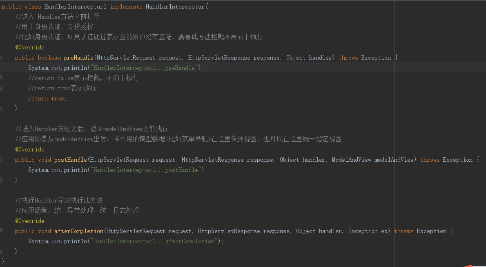
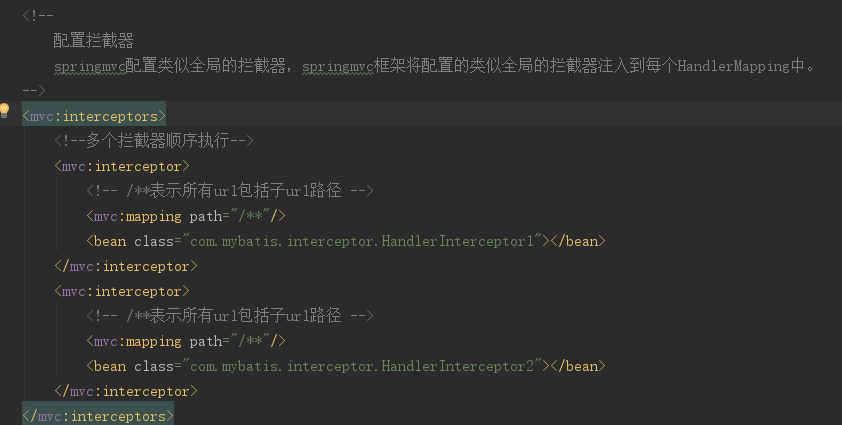
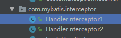
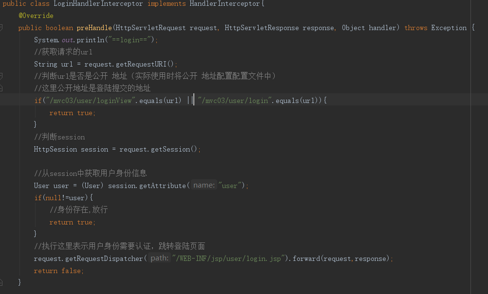
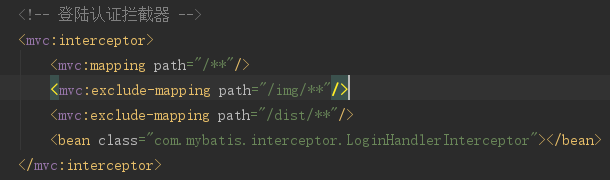

#拦截器
##拦截定义
定义拦截器，实现HandlerInterceptor接口。接口中提供三个方法。

##拦截器配置
###针对HandlerMapping配置

springmvc拦截器针对HandlerMapping进行拦截设置，如果在某个HandlerMapping中配置拦截，

经过该 HandlerMapping映射成功的handler最终使用该 拦截器。

~~~
<bean>
	class="org.springframework.web.servlet.handler.BeanNameUrlHandlerMapping">
	<property name="interceptors">
		<list>
			<ref bean="handlerInterceptor1"/>
			<ref bean="handlerInterceptor2"/>
		</list>
	</property>
</bean>
<bean id="handlerInterceptor1" class="springmvc.intercapter.HandlerInterceptor1"/>
<bean id="handlerInterceptor2" class="springmvc.intercapter.HandlerInterceptor2"/>
~~~

**不推荐使用**

###类似全局的拦截器
springmvc配置类似全局的拦截器，springmvc框架将配置的类似全局的拦截器注入到每个HandlerMapping中。

##测试
###测试需求
测试多个拦截器各各方法执行时机。
###编写两个拦截

###两个拦截器都放行
~~~
HandlerInterceptor1...preHandle
HandlerInterceptor2...preHandle

HandlerInterceptor2...postHandle
HandlerInterceptor1...postHandle

HandlerInterceptor2...afterCompletion
HandlerInterceptor1...afterCompletion
~~~

总结：
preHandle方法按顺序执行，

postHandle和afterCompletion按拦截器配置的逆向顺序执行。

###拦截器1放行，拦截器2不放行

~~~
HandlerInterceptor1...preHandle
HandlerInterceptor2...preHandle
HandlerInterceptor1...afterCompletion
~~~

总结：
拦截器1放行，拦截器2 preHandle才会执行。

拦截器2 preHandle不放行，拦截器2 postHandle和afterCompletion不会执行。

只要有一个拦截器不放行，postHandle不会执行。

###拦截器1不放行，拦截器2不放行

~~~
HandlerInterceptor1...preHandle
~~~

拦截器1 preHandle不放行，postHandle和afterCompletion不会执行。

拦截器1 preHandle不放行，拦截器2不执行。

###小结
根据测试结果，对拦截器应用。

比如：统一日志处理拦截器，需要该 拦截器preHandle一定要放行，且将它放在拦截器链接中第一个位置。

比如：登陆认证拦截器，放在拦截器链接中第一个位置。权限校验拦截器，放在登陆认证拦截器之后。（因为登陆通过后才校验权限）

##拦截器应用（实现登陆认证）
###需求
1. 用户请求url
2. 拦截器进行拦截校验
	1. 如果请求的url是公开地址（无需登陆即可访问的url），让放行
	2. 如果用户session 不存在跳转到登陆页面
	3. 如果用户session存在放行，继续操作。

##登陆controller方法

~~~
/**
 * 用户登录控制器
 * Created by success
 */
@Controller
@RequestMapping("/user")
//@SessionAttributes("user")
public class UserController {
    @Autowired
    private IUserService userService;

    //访问登录界面
    @RequestMapping("/loginView")
    public String userView(){
        return "user/login";
    }

    //登录处理
    @RequestMapping("/login")
    public String userLogin(String username,String password,Model model,HttpSession session){
        User user = userService.findByUsername(username);
        //判断用户名是否正确
        if(user!=null){
            //获取用户的密码
            if(user.getPassword().equals(password)){
                session.setAttribute("user",user);
                return "redirect:/items/queryItemsList";
            }else{
                //创建Map集合,用来保存错误信息
                Map<String,String> errorsMap = new HashMap<>();
              //  System.out.println("密码错误");
                errorsMap.put("pwd","密码错误!");
                model.addAttribute("errorsMap",errorsMap);
            }
        }else{
            Map<String,String> errorsMap = new HashMap<>();
           // System.out.println("用户名不正确!");
            errorsMap.put("usernull","用户不存在!");
            model.addAttribute("errorsMap",errorsMap);
        }
        return "user/login";
    }

    /**用户安全退出**/
    @RequestMapping("/logout")
    public String exit(HttpSession session){
        session.invalidate();//清空sessoin
        //重定向到商品列表页面
        return "redirect:/items/queryItemsList";
    }
}
~~~

##登陆认证拦截实现
###代码实现

###拦截器配置
