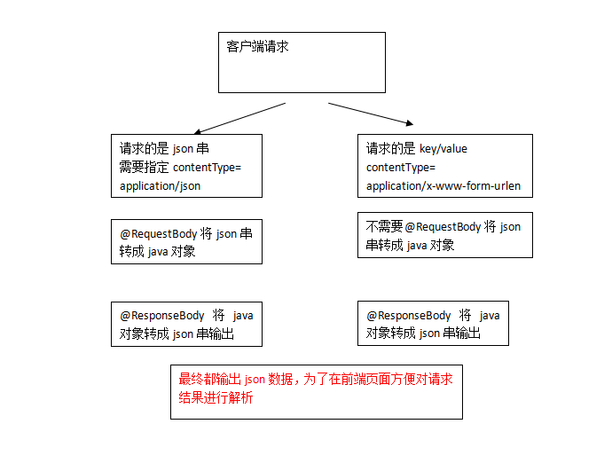
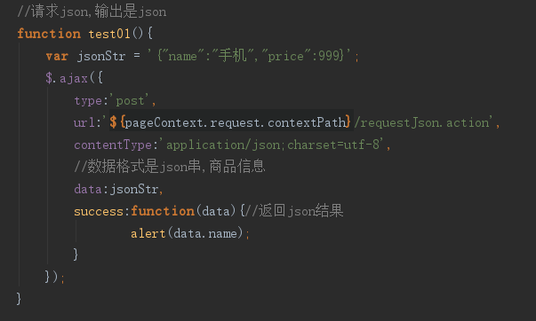
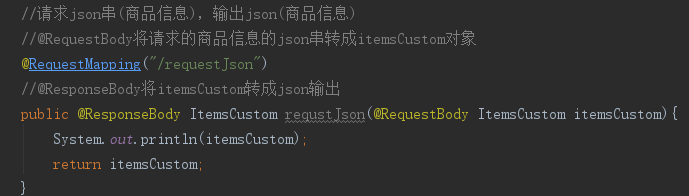
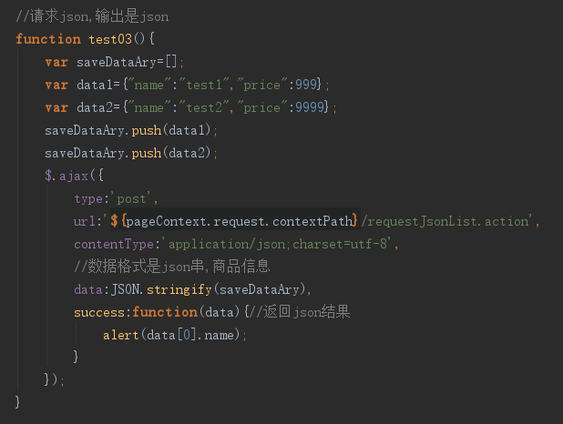
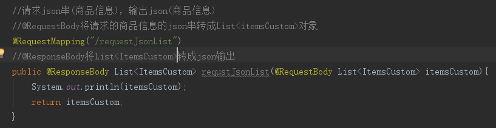
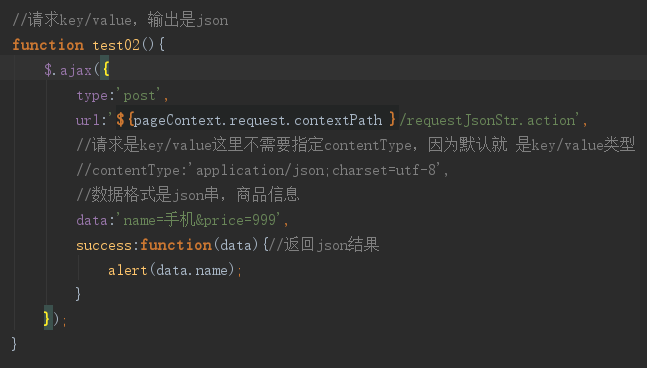
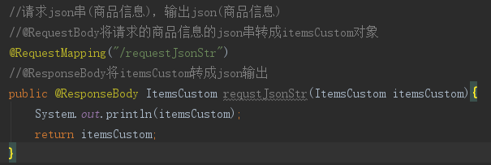
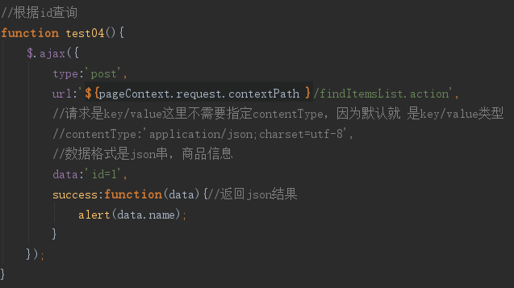
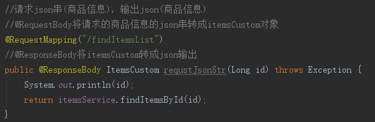

#json数据交互
##为什么要进行json数据交互
json数据格式在接口调用中、html页面中较常用，json格式比较简单，解析还比较方便。

比如：webservice接口，传输json数据.

##springmvc进行json交互

1. 请求json、输出json，要求请求的是json串，所以在前端页面中需要将请求的内容转成json，不太方便。

2. 请求key/value、输出json。此方法比较常用。

##环境准备
springmvc中使用jackson的包进行json转换（@requestBody和@responseBody使用下边的包进行json转），如下：

~~~
 <!--json-->
<dependency>
	<groupId>com.fasterxml.jackson.core</groupId>
	<artifactId>jackson-core</artifactId>
	<version>2.6.0</version>
</dependency>
<dependency>
	<groupId>com.alibaba</groupId>
	<artifactId>fastjson</artifactId>
	<version>1.2.17</version>
</dependency>
<dependency>
	<groupId>com.fasterxml.jackson.core</groupId>
	<artifactId>jackson-databind</artifactId>
	<version>2.6.0</version>
</dependency>
<dependency>
	<groupId>com.fasterxml.jackson.core</groupId>
	<artifactId>jackson-annotations</artifactId>
	<version>2.6.0</version>
</dependency>
~~~

##配置json转换器
在注解适配器中加入messageConverters

~~~
<!--注解适配器 -->
<bean class="org.springframework.web.servlet.mvc.method.annotation.RequestMappingHandlerAdapter">
	<property name="messageConverters">
	<list>
	<bean class="org.springframework.http.converter.json.MappingJacksonHttpMessageConverter"></bean>
	</list>
	</property>
</bean>
~~~

**注意：如果使用<mvc:annotation-driven /> 则不用定义上边的内容。**

##json交互测试
###输入json串，输出是json串
####jsp页面1
使用jquery的ajax提交json串，对输出的json结果进行解析。

####controller1

####jsp页面2

####controller1

###输入key/value，输出是json串

####jsp页面
使用jquery的ajax提交key/value串，对输出的json结果进行解析。

####controller

###练习
根据id来查询,使用jquery的ajax提交key/value串，对输出的json结果进行解析。

####jsp页面

####controller
