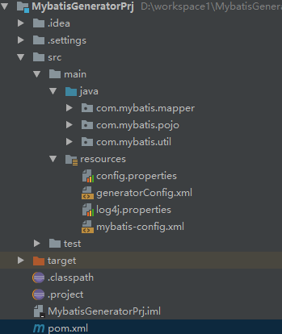
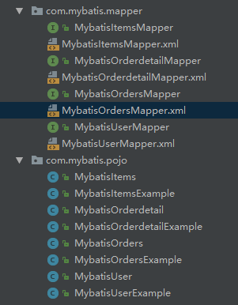

#附录2-Mybatis逆向工程

##什么是逆向工程

>mybaits需要程序员自己编写sql语句，mybatis官方提供逆向工程 

>可以针对单表自动生成mybatis执行所需要的代码（mapper.Java,mapper.xml、po..）

>>**数据库到java 代码**  

>>企业实际开发中，常用的逆向工程方式：

>>由于数据库的表生成java代码。

##操作步骤
1.工程结构

2.依赖配置

~~~
<dependency>
	<groupId>org.mybatis.generator</groupId>
	<artifactId>mybatis-generator-core</artifactId>
	<version>1.3.2</version>
</dependency>
~~~

3.添加代码配置文件

~~~
<?xml version="1.0" encoding="UTF-8"?>
<!DOCTYPE generatorConfiguration
  PUBLIC "-//mybatis.org//DTD MyBatis Generator Configuration 1.0//EN"
  "http://mybatis.org/dtd/mybatis-generator-config_1_0.dtd">

<generatorConfiguration>
    <context id="testTables" targetRuntime="MyBatis3">
        <!-- JavaBean 实现 序列化 接口 -->
        <plugin type="org.mybatis.generator.plugins.SerializablePlugin"></plugin>
        <!-- genenat entity时,生成toString -->
        <plugin type="org.mybatis.generator.plugins.ToStringPlugin" />
        <commentGenerator>
            <!-- 是否去除自动生成的注释 true：是 ： false:否 -->
            <property name="suppressAllComments" value="false" />
        </commentGenerator>
     	
     	<!-- 数据库连接信息 -->
        <jdbcConnection driverClass="oracle.jdbc.OracleDriver"
            connectionURL="jdbc:oracle:thin:@127.0.0.1:1521:xe" 
            userId="guan"
            password="guan">
        </jdbcConnection>

        <!-- 默认false，把JDBC DECIMAL 和 NUMERIC 类型解析为 Integer，为 true时把JDBC DECIMAL 和 
            NUMERIC 类型解析为java.math.BigDecimal -->
        <javaTypeResolver>
            <property name="forceBigDecimals" value="false" />
        </javaTypeResolver>

        <!-- targetProject:生成PO类的位置 -->
        <javaModelGenerator targetPackage="com.mybatis.pojo"
            targetProject=".\src\main\java">
            <!-- enableSubPackages:是否让schema作为包的后缀 -->
            <property name="enableSubPackages" value="false" />
            <!-- 从数据库返回的值被清理前后的空格 -->
            <property name="trimStrings" value="true" />
        </javaModelGenerator>
        <!-- targetProject:mapper映射文件生成的位置 -->
        <sqlMapGenerator targetPackage="com.mybatis.mapper" 
            targetProject=".\src\main\java">
            <!-- enableSubPackages:是否让schema作为包的后缀 -->
            <property name="enableSubPackages" value="false" />
        </sqlMapGenerator>
        <!-- targetPackage：mapper接口生成的位置 -->
        <javaClientGenerator type="XMLMAPPER"
            targetPackage="com.mybatis.mapper" 
            targetProject=".\src\main\java">
            <!-- enableSubPackages:是否让schema作为包的后缀 -->
            <property name="enableSubPackages" value="false" />
        </javaClientGenerator>
        <!-- 指定数据库表 -->
        <table tableName="mybatis_user"></table>
        <table tableName="mybatis_orders"></table>
        <table tableName="mybatis_items"></table>
      	<table tableName="MYBATIS_ORDERDETAIL"></table>
        <!-- <table schema="" tableName="sys_user"></table>
        <table schema="" tableName="sys_role"></table>
        <table schema="" tableName="sys_permission"></table>
        <table schema="" tableName="sys_user_role"></table>
        <table schema="" tableName="sys_role_permission"></table> -->
        
        <!-- 有些表的字段需要指定java类型
         <table schema="" tableName="">
            <columnOverride column="" javaType="" />
        </table> -->
    </context>
</generatorConfiguration>
~~~

4.运行逆向工程

建议使用java程序方式，不依赖开发工具有java环境即可。

代码如下:

~~~
package com.mybatis;

import java.io.InputStream;
import java.util.ArrayList;
import java.util.List;

import org.mybatis.generator.api.MyBatisGenerator;
import org.mybatis.generator.config.Configuration;
import org.mybatis.generator.config.xml.ConfigurationParser;
import org.mybatis.generator.internal.DefaultShellCallback;

public class StartServer {
	public void generator() throws Exception {
		List<String> warnings = new ArrayList<String>();
		boolean overwrite = true;
		InputStream configFile = Thread.currentThread().getContextClassLoader().getResourceAsStream("generatorConfig.xml");
		ConfigurationParser cp = new ConfigurationParser(warnings);
		Configuration config = cp.parseConfiguration(configFile);
		DefaultShellCallback callback = new DefaultShellCallback(overwrite);
	
		MyBatisGenerator myBatisGenerator = new MyBatisGenerator(config, callback, warnings);
		myBatisGenerator.generate(null);
	}

	public static void main(String[] args) throws Exception {
		try {
			StartServer startServer = new StartServer();
			startServer.generator();
		} catch (Exception e) {
			e.printStackTrace();
		}
	}
}
~~~

5.执行结果效果图:

